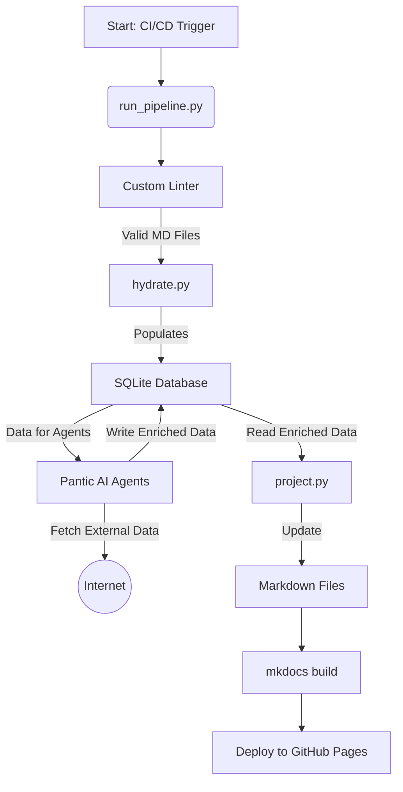

# Cargo Bikes Documentation Vault Brownfield Enhancement Architecture

## Introduction

This document outlines the architectural approach for enhancing the **Cargo Bikes Documentation Vault** with a new database-driven, agentic automation system. Its primary goal is to serve as the guiding architectural blueprint for AI-driven development of these new features while ensuring seamless and safe integration with the existing "Docs-as-Code" system.

This architecture is based on the comprehensive **Brownfield Enhancement PRD** and the initial project analysis conducted by the Analyst.

### Existing Project Analysis

#### Current Project State

- **Primary Purpose:** A "Docs-as-Code" system where Markdown files with YAML frontmatter serve as the primary data source for a static knowledge base website.
- **Current Tech Stack:** Python, `uv`, `mkdocs`, `pytest`, `ruff`, `pre-commit`, GitHub Actions.
- **Architecture Style:** A flat-file database (`vault/`) with a CLI-based application layer (`scripts/`).
- **Deployment Method:** Automated static site deployment to GitHub Pages via GitHub Actions.

#### Available Documentation

- A comprehensive `brownfield-architecture.md` (initial analysis) and `prd.md` (enhancement requirements) are available and have been used to create this document.

#### Identified Constraints

- The existing `mkdocs` build and deployment pipeline must not be broken.
- Manually curated "free-form" content within Markdown files must be preserved.
- All new code must adhere to the project's existing linting and formatting standards.

### Change Log

| Date       | Version | Description                                              | Author  |
| ---------- | ------- | -------------------------------------------------------- | ------- |
| 2024-05-22 | 1.0     | Initial draft of the Brownfield Enhancement Architecture | Winston |

## Enhancement Scope and Integration Strategy

### Enhancement Overview

- **Enhancement Type:** Major architectural evolution, introducing a new data persistence layer and an autonomous agent system.
- **Scope:** The project will move from a "Git-as-a-database" model to a "MD-First Composable Database" model.
- **Integration Impact:** Major. This introduces a new, central SQLite database and a three-phase data pipeline that will become the primary engine for content updates.

### Integration Approach: MD-First with Fenced Blocks

The core data flow will be unidirectional within a single pipeline run: `MD -> DB -> MD`.

1. **Phase 1: Hydration (`MD files -> Database`)**: Scripts will parse the YAML frontmatter of all valid `.md` files to populate an in-memory or file-based SQLite database. This creates a structured, queryable replica of the vault's state.
2. **Phase 2: Enrichment (`Agents -> Database`)**: New Pantic AI agents will execute their tasks (e.g., fetching reseller prices) and write their findings directly to the SQLite database.
3. **Phase 3: Projection (`Database -> MD files`)**: Scripts will read the enriched data from the database and write it back to the `.md` files, updating both the YAML frontmatter and specific, comment-fenced blocks in the body (e.g., `<!-- BIKE_SPECS_TABLE_START -->`).

### Compatibility Requirements

- **Existing API Compatibility:** The existing "API" (the Python scripts' CLI) will be supplemented, not replaced. The `generate_bike_table.py` script may be deprecated in favor of the new projection logic.
- **Database Schema Compatibility:** The new SQLite schema will be derived from and must remain compatible with the schemas defined in `docs/schema/`.
- **UI/UX Consistency:** Not applicable (backend-focused).
- **Performance Impact:** The new data pipeline will add time to the CI/CD run, which must be kept within acceptable limits (target < 5 minutes).

## Tech Stack Alignment

### Existing Technology Stack

The project will continue to use Python, `uv`, `mkdocs`, `pytest`, `ruff`, and GitHub Actions as its core stack.

### New Technology Additions

| Technology        | Version  | Purpose                                                   | Rationale                                                                  |
| ----------------- | -------- | --------------------------------------------------------- | -------------------------------------------------------------------------- |
| **Pantic AI**     | `latest` | Framework for building the autonomous LLM-powered agents. | Specified in the PRD for agentic automation.                               |
| **SQLAlchemy**    | `latest` | Python SQL toolkit and Object Relational Mapper (ORM).    | Provides a robust, schema-driven way to interact with the SQLite database. |
| **SQLite**        | `latest` | File-based SQL database engine.                           | Meets the non-functional requirement for a portable, lightweight database. |
| **Typer / Click** | `latest` | Library for creating command-line interfaces.             | Will be used to build the CLI for the new agents and pipeline scripts.     |

## Data Models and Schema Changes

### New Data Models (SQLite)

A new database schema will be created in `scripts/database/schema.py` using SQLAlchemy. It will include tables that directly map to the existing schemas:

- `bikes`: Based on `BIKE_SPECS_SCHEMA.md`.
- `brands`: Based on `MANUFACTURER_SCHEMA.md` (for `type: brand`).
- `manufacturers`: Based on `MANUFACTURER_SCHEMA.md` (for `type: manufacturer`).
- `components`: Based on `COMPONENT_SCHEMA.md`.
- `resellers`: A table to store reseller data, linked to the `bikes` table.

### Schema Integration Strategy

- **Database Changes Required:** A new `vault.db` file will be created. This file will be managed by scripts and listed in `.gitignore`.
- **Migration Strategy:** A one-time migration script (`scripts/database/hydrate.py`, as per Story 1.3) will parse all existing `.md` files to perform the initial population of the database.
- **Backward Compatibility:** Not applicable, as this is an additive change. The `.md` files remain the primary source of truth.

## Component Architecture

The new system will be composed of several new, interconnected components:

- **Custom Markdown Linter (`scripts/linters/`)**:
  - **Responsibility**: Validates that `.md` files have the required structure (valid YAML, required comment-fenced blocks) to be safely processed by the pipeline.
- **Hydration Service (`scripts/database/hydrate.py`)**:
  - **Responsibility**: Reads data from the YAML frontmatter of all valid `.md` files and populates the SQLite database.
- **Pantic AI Agents (`scripts/agents/`)**:
  - **Responsibility**: A collection of autonomous agents (starting with `price_updater`) that perform external data fetching and write their findings into the SQLite database.
- **Projection Service (`scripts/database/project.py`)**:
  - **Responsibility**: Reads enriched data from the database and writes it back to the `.md` files, updating the frontmatter and the machine-managed content blocks.
- **Pipeline Orchestrator (`scripts/run_pipeline.py`)**:
  - **Responsibility**: Acts as the main entry point for the entire data pipeline, executing the linter, hydration, agents, and projection in the correct sequence.

### Component Interaction Diagram



## Source Tree Integration

The project's `scripts/` directory will be reorganized to accommodate the new components:

```plaintext
scripts/
├── agents/
│   └── price_updater/
│       ├── __init__.py
│       ├── agent.py
│       └── cli.py
├── database/
│   ├── __init__.py
│   ├── hydrate.py
│   ├── init_db.py
│   ├── project.py
│   └── schema.py
├── linters/
│   └── validate_structure.py
└── run_pipeline.py
```

## Infrastructure and Deployment Integration

- **Existing Infrastructure:** GitHub Actions and GitHub Pages will continue to be used.
- **Enhancement Deployment Strategy:** The `.github/workflows/deploy-pages.yml` file will be modified. A new `update-vault-data` job will be added to run _before_ the `build` job.
- **Pipeline Integration:** This new job will execute the `scripts/run_pipeline.py` orchestrator. It will also be responsible for committing any changes made to the `.md` files back to the repository before the `build` job runs, ensuring the deployed site is always up-to-date.

## Coding Standards and Conventions

All new Python code must adhere to the existing standards enforced by `ruff` and `pre-commit`. Key standards include:

- PEP 8 compliance, enforced by `ruff`.
- Consistent formatting, enforced by `ruff format`.
- Type hints for all new functions.
- Comprehensive docstrings for all new modules and public functions.

## Testing Strategy

- **Integration with Existing Tests:** The existing `pytest` setup will be used. New test files will be added to the `tests/` directory.
- **New Testing Requirements:**
  - **Unit Tests:** Each new component (linter, hydration script, projection script, agent modules) must have extensive unit tests covering its logic.
  - **Integration Tests:** A suite of integration tests will be developed to test the entire `MD -> DB -> MD` pipeline using a temporary, in-memory SQLite database and a set of sample `.md` files.
  - **Agent Tests:** Tests for the Pantic AI agents will involve mocking external web requests to ensure the data parsing and database-writing logic is correct.

## Checklist Results Report

_This section will be populated after this architecture document is reviewed. The `architect-checklist` should be run against this document to identify any gaps or inconsistencies._

## Next Steps

This document provides the architectural blueprint for the proposed enhancement. The next phase is implementation, which should begin by following the story sequence defined in the PRD.

- **Story Manager Handoff**: The development work is structured into three epics. Please begin by creating the detailed story file for **Story 1.1: Database Schema and Initialization**. Ensure the story includes all necessary context from this architecture document for the developer agent to succeed.
